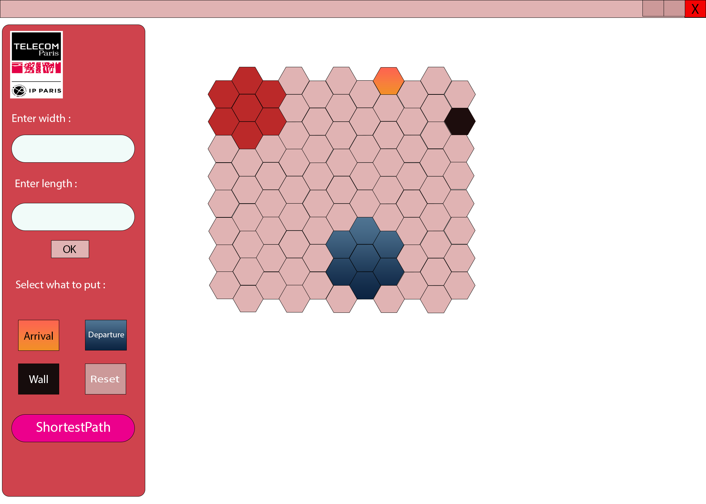

# Maze Solver by Zakaria AKIL
## Table of Contents

- [Project description](#Project_description)
- [Functionality](#Functionality)
- [Files guide](#Files_guide)
- [Examples](#examples)
## Project description
The project is located in the git repository as 
This project is about an hexagonal maze solver. It is an application that allows users to solve the mazes they create themselves. I started with the algorithmic part, in which I applied Dijkstra algorithm to find the shortest path in a graph between two nodes. Then I switched to work on the GUI of my application. I started by designing a GUI model with Adobe Photoshop ("tp04/InterfaceGraphiqueModel01") to reach, as well as a logo for my application ("tp04/logoGUI"). In the next parts of this README file I am going to specify fils to execute and to explain how it generally works.

## Functionality
### `To run the graphic application, you should run the MainApp.java file ("\tp04\src\graphicInterface\MainApp.java").`
In the menu bar, you will find "?" item which will lead you to "help". I tried to explain how to handle the application.

1. Run the MainApp.java file, the application will be displayed;
2. To configure your maze, there is two ways :
### Import it from a text file

To do so, you should click on File menu item at the top, and then you will find "import from file" button. A choice dialog window will be displayed, and will allow you to select your file.\
The file must contain a valid maze, that's mean that the maze should be constructed by using only : "D" for departure, "A" for arrival, "E" for empty, and "W" for wall.\
A valid maze contains only one departure and one arrival.\
Example of a valid maze : \
    `WWWWEW`\
    `EDEEEE`\
    `WWEWWE`\
    `EEEEEE`\
    `AEEEEW`
### Draw it manually on the display panel\
- Select the dimensions in the configuration panel;
- Select the type, and click on the boxes you want to be the type selected. 
3. As your maze is configured, press ShortestPath button in the configuration panel to see the solution;
4. You can save the solution in a text file using save item in File menu.
5. If you want to try with another maze you should reset the maze, pressing the ok button after choosing the wanted dimensions.

## Files guide
There are 3 files to run (that contain a main method) : \
    1. tp04\src\MainPackage\MainTest : It is just a classe to test the ability to initiate from a file and save to file.\
    2. tp04\src\MainPackage\Main : This class will show the solution in the consol.\

tp04\data : contain two text files we use them in the MainTest class
tp04\processingData : contain a text file that is always used to find the solution for the maze the user want to solve with the application. This text file contains the actual maze the application is handling.\
    
## Example
    input : 
    EEEEEWEEEE
    EWEEEWWEEE
    EEEEWAWEEE
    WEEEWWEEEE
    EEEEEWEEEE
    EEEEWEEEEE
    EWWEEEWEEE
    EEEEEEEEEE
    EEEEEEEEED

    output : 

    E E E E E W E E E E
     E W E * * W W E E E
    E E E * W A W E E E
     W E * E W W E E E E 
    E E E * E W E E E E
     E E E * W E E E E E
    E W W E * E W E E E 
     E E E E * * * * * E
    E E E E E E E E E D

    The solution is graphique, but you can save it in a text file !
